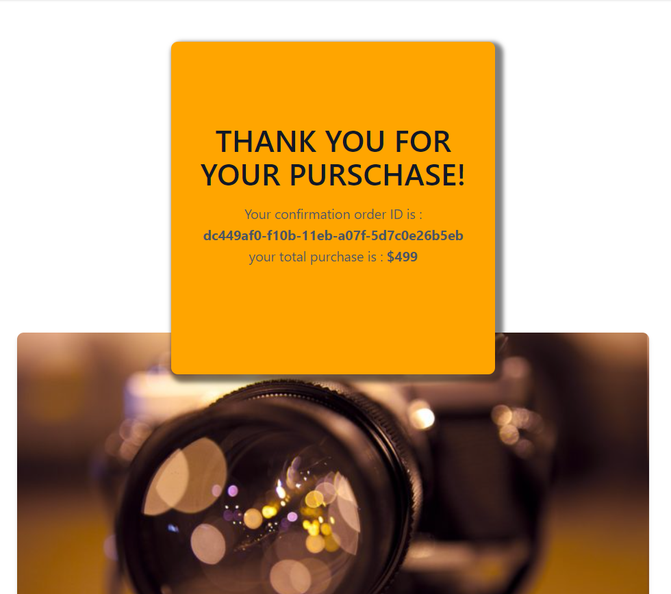

# TEST PLAN

## Getting started

### Test 1 : Clone the repo

Action :  

- Run `git clone``https://github.com/OpenClassrooms-Student-Center/JWDP5` in a folder  


Expect result :

```
Cloning into 'JWDP5'...  
remote: Enumerating objects: 164, done.  
remote: Counting objects: 100% (40/40), done.  
remote: Compressing objects: 100% (26/26), done.  
remote: Total 164 (delta 16), reused 30 (delta 14), pack-reused 124  
Receiving objects: 100% (164/164), 7.41 MiB | 1.55 MiB/s, done.  
Resolving deltas: 100% (63/63), done.
```

### Test 2 : Install backend

action : 

- Run `npm install` in the new JWDP5 cloned  


Expect result :

```
npm WARN [orinoco-backend@1.0.0](mailto:orinoco-backend@1.0.0) No repository field.added 57 packages from 41 contributors and audited 57 packages in 1.004s  
found 0 vulnerabilities
```

### Test 3 : Run backend

Action :

- Run `node server` and in another terminal, run `curl -I` `http://localhost:3000/api/cameras/`


Expect result :

```
HTTP/1.1 200 OK  
X-Powered-By: Express  
Access-Control-Allow-Origin: *  
Access-Control-Allow-Headers: Origin, X-Requested-With, Content, Accept, Content-Type, Authorization  
Access-Control-Allow-Methods: GET, POST, PUT, DELETE, PATCH, OPTIONS  
Content-Type: application/json; charset=utf-8  
Content-Length: 1512  
ETag: W/"5e8-QoIiHFPzVZuoAcKni9LxwhisF3k"  
Date: Thu, 29 Jul 2021 21:38:10 GMT  
Connection: keep-alive
```

### Test 4: Open Homepage

Action :  

- Open [Homepage](https://agpa-88.github.io/OC_P5_AA/index.html) in your browser


Expected result :


### Test 5: Open Product page

Action :  

- Click on the Check More of a product (e.g. ZURSS 50S)


Expected result :


### Test 6: Add Product to cart

Action :

- Click on the Add to Cart button

Expected result :

- Your cart icon should look like this before adding any product to the cart:


- Your cart icon should look like this after adding any product to the cart


### Test 7: Remove product from cart

Action : 

- Open your cart and click on the trash icon next to the product you wish to remove

Expected result :

- Your cart should look like this after adding a product:


- Your cart should look like this after removing the product:


### Test 8: Add 2 products to cart

Action : 

- Open 2 different product pages and add them to your cart


Expected result :


### Test 9: Add twice the same products to cart

Action :

- Go to a product page and add the same product twice in the cart

Expected result :


### Test 10: Order products without entering information

Action : 

- Click on the Order button to open the form section and, without adding any information into the form, click on the Checkout button

Expected result :


### Test 11: Order products with all information correctly set

Action :

- After clicking on the Order button add your information to the Customer Details form and then click on the Checkout button

Expected result :


